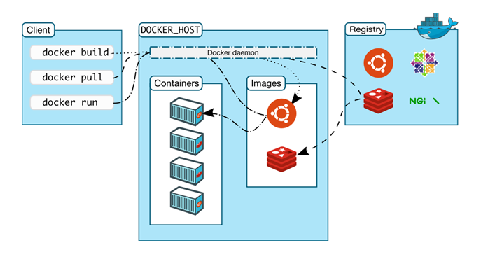

# Docker

## Steps To Install Docker

**Pre requisite:** Enter your Computer Bios and make sure Virutalization is enabled


1. Go to the website and click Install
2. Run the executable
3. Restart computer if neccesary
4. Open Git Bash and run `Docker -v` to check if its installed

Extra Step: Once installed Enable `Expose daemon on tcp://localhost:2375 without TLS`

## Docker Architecture and Image Management

Docker follows a client-server architecture, where the Docker client interacts with the Docker daemon to manage containers and images. Understanding Docker's architecture is essential for efficiently working with Docker images.

### 1. Docker Client and Daemon

- **Docker Client**: The Docker client is a command-line tool that allows users to interact with Docker. It sends commands to the Docker daemon to perform actions such as building, running, and managing containers.

- **Docker Daemon**: The Docker daemon (also known as `dockerd`) is a background process responsible for managing Docker objects such as images, containers, volumes, and networks. It handles the heavy lifting of building, running, and distributing Docker containers.

### 2. Image Management

- **Image Creation**: Docker images are created using Dockerfiles, which contain instructions for building the image. When you run the `docker build` command, the Docker daemon reads the Dockerfile and builds the image layer by layer.

- **Image Storage**: Docker images are stored in a local repository on the host system. They can also be pushed to and pulled from remote registries such as Docker Hub or private registries. Images are downloaded from registries when they are needed to run a container.

### 3. Docker Compose

- **Docker Compose**: Docker Compose is a tool for defining and running multi-container Docker applications. It allows you to specify the configuration of your application in a YAML file (`docker-compose.yml`) and manage multiple containers as a single application.

### 4. Client-Server Communication

- **REST API**: The Docker client communicates with the Docker daemon using a REST API. This API allows users to perform various operations on Docker objects programmatically.

- **Communication Channels**: The Docker client and daemon can communicate over UNIX sockets (on Linux) or named pipes (on Windows) for local communication. They can also communicate over a network interface, allowing you to connect a Docker client to a remote Docker daemon.

**Diagram:**



### Conclusion

Understanding Docker's client-server architecture and image management processes is crucial for effectively building, running, and managing Docker containers and images.


## How to create an image (Using commit)


1. **Run NGINX Container**:
   ```bash
   docker run -d -p 80:80 --name my-nginx nginx
   ```
   This command runs a new NGINX container in detached mode (`-d`), maps port 80 of the host to port 80 of the container (`-p 80:80`), and names the container `my-nginx`.

2. **Copy a File to the Container**:
   ```bash
   docker cp ~/Downloads/index.html my-nginx:/usr/share/nginx/html/index.html
   ```
   This command copies the `index.html` file from your local machine to the NGINX container at the specified path.

3. **Commit Changes to Create a New Image**:
   ```bash
   docker container commit -a "Your Name" -m "Added custom index.html" my-nginx my-nginx-custom
   ```
   This command commits the changes made to the `my-nginx` container, creating a new image named `my-nginx-custom` with the specified author (`-a`) and commit message (`-m`).

4. **Tag the Image**:
   ```bash
   docker tag my-nginx-custom username/my-nginx-custom:latest
   ```
   This command tags the newly created image with your Docker Hub username and a version tag (`latest` in this case). Replace `username` with your Docker Hub username.

5. **Login to Docker Hub**:
   ```bash
   docker login
   ```
   Enter your Docker Hub username and password when prompted to authenticate.

6. **Push the Image to Docker Hub**:
   ```bash
   docker push username/my-nginx-custom:latest
   ```
   This command pushes the tagged image to Docker Hub, making it available for others to use.

## How to create an image (Using Dockerfile)


# Building a Docker Image for Hosting a Static Web Page

This Dockerfile is designed to build an image for hosting a static web page using NGINX.

### Dockerfile Content:

```Dockerfile
# This Dockerfile is to build an image/microservice to host a static web page        

# Which base image to use
FROM nginx:latest

# Who is building it
LABEL MAINTAINER=LRAMADANI@SPARTAGLOBAL.COM

# Copy the index.html from localhost to /usr/share/nginx/html/
COPY index.html /usr/share/nginx/html/

# Which ports to expose/enable
EXPOSE 80

# Launch the server / NGINX official command using CMD        
CMD ["nginx", "-g", "daemon off;"]
```

### Steps to Create the Image:

1. **Open Terminal**: Open a terminal window on your system.

2. **Navigate to Directory**: Navigate to the directory where your Dockerfile is located.

   ```
   cd /path/to/your/dockerfile/directory
   ```

3. **Create or Edit Dockerfile**: Use the `nano` command to create or edit the Dockerfile.

   ```
   nano Dockerfile
   ```

4. **Copy and Paste Content**: Copy the provided Dockerfile content and paste it into the `nano` text editor.

5. **Save and Exit**: Press `Ctrl + X` to exit `nano`. If prompted to save changes, press `Y` for yes, then press `Enter` to confirm the file name.

6. **Build the Image**: Once you've saved the Dockerfile, build the Docker image using the `docker build` command.

   ```
   docker build -t my-static-web-server .
   ```

7. **Verify the Image**: After the build process completes, verify that the image was created successfully using the `docker images` command.

   ```
   docker images
   ```

### Running the Website to Test It:

To run the website and test it locally, you can create a container from the newly created image and map port 80 of the container to a port on your host machine.

```
docker run -d -p 8080:80 --name my-web-server my-static-web-server
```

Now, you can access the website by navigating to `http://localhost:8080` in your web browser.

### Pushing the Image to Docker Hub:

If you want to share the image or deploy it to a remote server, you can push it to Docker Hub.

1. **Login to Docker Hub**: Use the `docker login` command to authenticate with Docker Hub.

   ```
   docker login
   ```

2. **Tag the Image**: Tag the image with your Docker Hub username and repository name.

   ```
   docker tag my-static-web-server username/my-static-web-server:latest
   ```

3. **Push the Image**: Push the tagged image to Docker Hub.

   ```
   docker push username/my-static-web-server:latest
   ```

Replace `username` with your Docker Hub username.

That's it! You've successfully built, tested, and pushed your Docker image for hosting a static web page.
```

## How to run the Sparta Node.js app in a container

```
# Building a Docker Image for the SpartaGlobal Node.js App

This Dockerfile is designed to build an image for the SpartaGlobal Node.js application.

### Dockerfile Content:

```Dockerfile
# Create a script to build an image/microservice of nodejs-app
# Containerize the node app
# Build the image
# Test the image on port 3000 locally
# If works - push it to your Docker Hub and share the image

# Use an official Node runtime as a parent image
FROM node:12

# Set the working directory in the container
WORKDIR /usr/src/app

# Copy the entire app directory to the working directory in the container
COPY . .

# Install the dependencies
RUN npm install

# Expose port 3000
EXPOSE 3000

# Command to run the application
CMD ["npm", "start"]
```

### Steps to Create the Image:

1. **Open Terminal**: Open a terminal window on your system.

2. **Navigate to the App Directory**: Navigate to the `app/app` directory where your Dockerfile is located.

   ```
   cd /path/to/your/app/app/directory
   ```

3. **Create or Edit Dockerfile**: Use the `nano` command to create or edit the Dockerfile.

   ```
   nano Dockerfile
   ```

4. **Copy and Paste Content**: Copy the provided Dockerfile content and paste it into the `nano` text editor.

5. **Save and Exit**: Press `Ctrl + X` to exit `nano`. If prompted to save changes, press `Y` for yes, then press `Enter` to confirm the file name.

6. **Build the Image**: Once you've saved the Dockerfile, build the Docker image using the `docker build` command.

   ```
   docker build -t username/nodejs-app .
   ```

   Replace `username` with your Docker Hub username.

7. **Verify the Image**: After the build process completes, verify that the image was created successfully using the `docker images` command.

   ```
   docker images
   ```

### Running the App to Test It Locally:

To run the application and test it locally, create a container from the newly created image and map port 3000 of the container to port 3000 on your host machine.

```
docker run -p 3000:3000 --name nodejs-app username/nodejs-app
```

Now, you can access the application by navigating to `http://localhost:3000` in your web browser.

### Pushing the Image to Docker Hub:

If you want to share the image or deploy it to a remote server, you can push it to Docker Hub.

1. **Login to Docker Hub**: Use the `docker login` command to authenticate with Docker Hub.

   ```
   docker login
   ```

2. **Tag the Image**: Tag the image with your Docker Hub username and repository name.

   ```
   docker tag username/nodejs-app username/nodejs-app:latest
   ```

3. **Push the Image**: Push the tagged image to Docker Hub.

   ```
   docker push username/nodejs-app:latest
   ```

Replace `username` with your Docker Hub username.

That's it! You've successfully built, tested, and pushed your Docker image for the SpartaGlobal Node.js app.


## Docker Logs and Container Management

### Viewing Live Logs

To run an NGINX container and view its live logs, use the following command:

```
docker run -p 80:80 nginx
```

This will start an NGINX container and map port 80 of the container to port 80 on the host machine. You can see the live logs directly in your terminal.

### Viewing Container Logs

To view the logs of a specific container, use the `docker logs` command followed by the container ID:

```
docker logs <container_id>
```

Replace `<container_id>` with the actual ID of the container. For example:

```
docker logs 9485cf080319
```

This command will display the logs generated by the specified container.

### Removing Containers

To remove a container, use the `docker rm` command followed by the container ID:

```
docker rm <container_id>
```

For example, to remove a container with ID `9485cf080319`:

```
docker rm 9485cf080319
```

If a container is still running and you want to forcefully remove it, use the `-f` flag:

```
docker rm <container_id> -f
```

For example, to forcefully remove a running container with ID `8bb23b3f74f5`:

```
docker rm 8bb23b3f74f5 -f
```

These commands help you manage the lifecycle of your Docker containers effectively.

Volume - Data to be attached like a USB