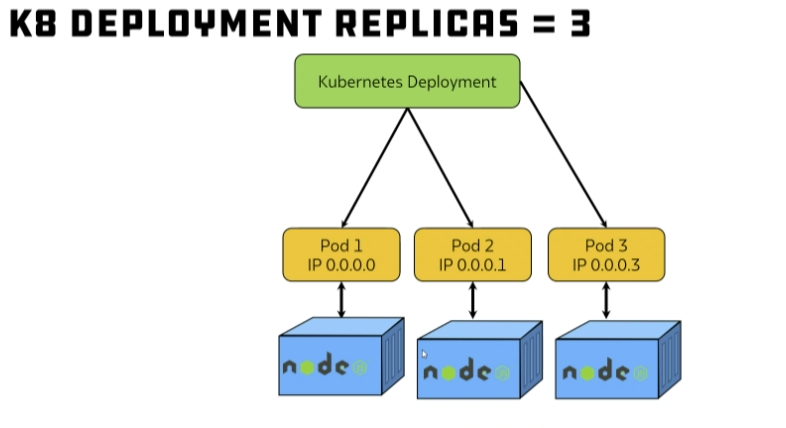
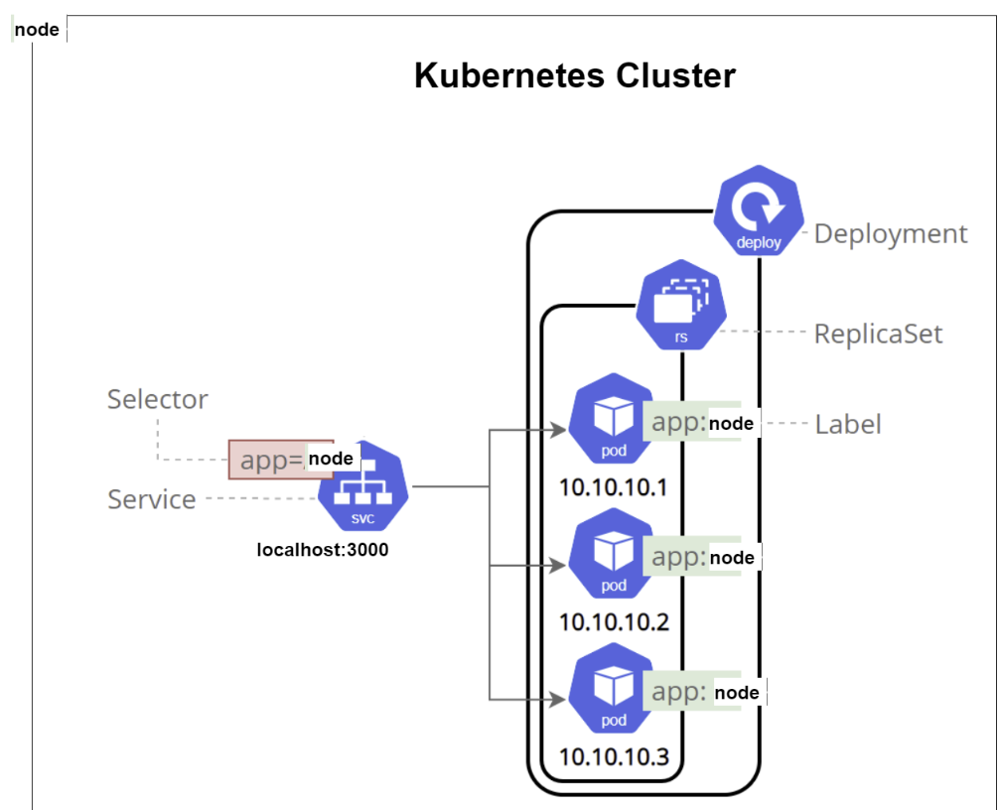

# Kubernetes Overview

Kubernetes, often abbreviated as K8s, is an open-source platform designed to automate the deployment, scaling, and operation of containerized applications. It helps manage and orchestrate containers, providing a robust framework for running distributed systems resiliently and efficiently.

## Key Components of Kubernetes

### Cluster
The fundamental unit in Kubernetes, consisting of a set of worker machines, called nodes, and a control plane responsible for managing the cluster.

### Node
A single machine (physical or virtual) in the Kubernetes cluster, running containerized applications. Each node contains:
- **Kubelet:** An agent that ensures containers are running in a pod.
- **Kube-proxy:** A network proxy that maintains network rules and handles network communication within and outside the cluster.
- **Container Runtime:** Software responsible for running containers (e.g., Docker, containerd).

### Control Plane
Manages the Kubernetes cluster. Key components include:
- **API Server:** The central management entity that interacts with the cluster through RESTful API calls.
- **etcd:** A distributed key-value store that holds the cluster's state and configuration.
- **Controller Manager:** A daemon that regulates the state of the cluster by managing controllers, which handle routine tasks (e.g., node lifecycle, endpoints, etc.).
- **Scheduler:** Assigns workloads to nodes based on resource availability and other constraints.

### Pod
The smallest deployable unit in Kubernetes, a pod encapsulates one or more containers that share storage, network, and a specification for how to run the containers.

### Service
An abstraction that defines a logical set of pods and a policy by which to access them. Services enable load balancing and service discovery.

### Namespace
A mechanism to partition resources within a cluster, useful for managing multiple teams or projects.

### ReplicaSet
Ensures that a specified number of pod replicas are running at any given time.

### Deployment
Provides declarative updates for pods and ReplicaSets, enabling rolling updates and rollbacks.

### ConfigMap and Secret
Mechanisms for injecting configuration data into containers, with Secrets specifically designed for sensitive information.

## Features and Benefits

- **Automated Scheduling:** Efficiently places containers based on resource requirements and constraints, optimizing utilization.
- **Self-Healing:** Automatically restarts failed containers, replaces and reschedules containers when nodes die, and kills containers that don't respond to health checks.
- **Horizontal Scaling:** Can scale applications up and down automatically based on CPU utilization or other select metrics.
- **Service Discovery & Load Balancing:** Automatically assigns IP addresses and a single DNS name for a set of pods, distributing traffic across them.
- **Automated Rollouts and Rollbacks:** Gradually rolls out changes to the application or its configuration, while monitoring application health.
- **Storage Orchestration:** Automatically mounts the storage system of your choice, such as local storage, public cloud providers, etc.
- **Batch Execution:** Manages batch and CI workloads, replacing failed containers if desired.

## How Kubernetes Works

1. **Cluster Initialization:** A cluster is created, consisting of multiple nodes managed by the control plane.
2. **Deployment:** Developers define the desired state of the application (e.g., how many instances, which container images to use) in YAML or JSON configuration files.
3. **Orchestration:** The control plane schedules and manages the lifecycle of containers, ensuring the desired state is maintained.
4. **Monitoring and Management:** Kubernetes continuously monitors the cluster and applications, automatically healing and scaling them as needed.

## Use Cases

- **Microservices:** Simplifies the management of microservices by providing tools for deploying, scaling, and managing containerized applications.
- **CI/CD Pipelines:** Facilitates continuous integration and continuous deployment processes by automating the deployment of applications and their updates.
- **Hybrid and Multi-Cloud Deployments:** Allows consistent deployment and management across different environments, whether on-premises or in the cloud.
- **Big Data and Machine Learning:** Manages workloads for data processing and machine learning tasks efficiently.

Kubernetes is a powerful platform that has become the industry standard for container orchestration, enabling organizations to deploy and manage applications at scale with greater ease and efficiency.

## Kubernetes Deployment Diagram

Here is an example Kubernetes deployment configuration and a description of the corresponding deployment diagram.

```
apiVersion: apps/v1
kind: Deployment
metadata:
  name: nginx-deployment
spec:
  selector:
    matchLabels:
      app: nginx
  replicas: 3
  template:
    metadata:
      labels:
        app: nginx
    spec:
      containers:
      - name: nginx
        image: luir/nginxtech258:latest
        ports:
        - containerPort: 80
```

### Key Concepts: Labels and Selectors

1. **Labels:**
   - Labels are key-value pairs attached to objects such as pods, services, and deployments in Kubernetes. They provide a way to organize and select subsets of objects.
   - In the deployment YAML above, the label `app: nginx` is attached to the pod template. This label helps identify and group the pods created by this deployment.

2. **Selectors:**
   - Selectors are used to find and interact with Kubernetes objects based on their labels.
   - The deployment's selector `matchLabels: app: nginx` ensures that the deployment manages only the pods with the label `app: nginx`.

### Deployment Diagram Description

1. **Kubernetes Deployment:**
   - The deployment named `nginx-deployment` is created based on the YAML configuration. It specifies that three replicas of the pod should be running.

2. **Pods:**
   - Three pods are created by the deployment. Each pod contains a single container running the `nginx` image specified in the deployment.
   - The pods are labeled with `app: nginx`, matching the deployment's selector.

3. **Nodes:**
   - Each pod is scheduled on a node within the Kubernetes cluster. Nodes can be physical or virtual machines.
   - In the diagram, each pod (Pod 1, Pod 2, Pod 3) is shown with an associated IP address (e.g., 0.0.0.0, 0.0.0.1, 0.0.0.3).

### Visual Diagram Description



### Explanation

- The deployment "nginx-deployment" is responsible for creating and managing three replicas of the pod.
- Each pod is labeled with `app: nginx` and contains one nginx container.
- The deployment uses labels and selectors to ensure the correct pods are managed.
- Each pod runs on a node and has a unique IP address for internal network communication.

This diagram and explanation should help clarify the Kubernetes deployment process and the role of labels and selectors in managing pods within a cluster.


## Deploying Node.js App on a Single-Node Cluster

### Overview
This documentation outlines the steps to deploy a Node.js application on a single-node Kubernetes cluster. The deployment consists of creating a Kubernetes Deployment and a NodePort Service. Here's a high-level overview of the architecture:

### Diagram 



- **Node**: The single node in your Kubernetes cluster where the application is deployed.
- **Kubernetes Cluster**: The cluster that manages the deployment and scaling of your application.
- **Deployment**: Defines the desired state of your application, including the number of replicas.
- **Replica Set**: Ensures that the specified number of pod replicas are running at all times.
- **Pods**: Instances of your application. In this example, three pods are created, each running the Node.js application with the label `app: node`.
- **Service**: Exposes the application to external traffic. The service uses a selector to match the pods with the label `app: node` and makes the application accessible at `localhost:3000`.
  
### Deploying Node.js Application

To deploy a Node.js application on a single-node Kubernetes cluster, you can use a deployment YAML file (`node-deploy.yml`). This file describes the deployment configuration for your application:

```yaml
# use spaces not a tab

apiVersion: apps/v1 # which api to use for deployment
kind: Deployment # pod - service what kind of service/object you want to create
# what would you like to call it - name the service/object
metadata:
  name: node-deployment # naming the deployment
spec:
  selector:
    matchLabels:
      app: node # look for this label to match with k8 service
      # Lets create replica set of this with instances/pods
  replicas: 3 # 3 pods
    # template to use it's label for K8 service to launch in the browser
  template:
    metadata:
      labels:
        app: node # this label connects to
                   #the service or any other k8 components
  # Let's define the container spec
    spec:
      containers:
      - name: node
        image: luir/nodejs-app:latest # use the image that you built
        ports:
        - containerPort: 3000
```

This YAML file defines a Kubernetes deployment for the Node.js application. It specifies the number of replicas, container image, and port to expose.

### Creating NodePort Service

After deploying the Node.js application, you need to expose it to external traffic. You can create a NodePort service using a service YAML file (`node-service.yml`):

```yaml
# Select the type of API version and type of service/object
apiVersion: v1
kind: Service
# Metadata for name
metadata:
  name: node-svc
  namespace: default # You can change to the required namespace
# Specification to include ports Selector to connect to the deployment
spec:
  ports:
    - nodePort: 30001 # range is 30000-32768
      port: 3000
      targetPort: 3000

  # Let's define the selector and label to connect to nginx deployment
  selector:
    app: node # This label connects this service to deployment

  # Creating NodePort type of service
  type: NodePort # Also use LoadBalancer - for local use ClusterIP
```

This YAML file creates a NodePort service named `node-svc` to expose the Node.js application. It specifies the target port and node port for accessing the application.

### Deploying the Application

To deploy the Node.js application and create the service, apply the YAML files using the `kubectl apply` command:

```bash
kubectl apply -f node-deploy.yml
kubectl apply -f node-service.yml
```

Once deployed, you can access the Node.js application using the NodePort specified in the service YAML file.


### Deleting the Application

If you need to delete the Node.js application and the service, you can delete the resources defined in the YAML files using the `kubectl delete` command:

```bash
kubectl delete -f node-deploy.yml
kubectl delete -f node-service.yml
```

This will remove the deployment and the service from your Kubernetes cluster.

That's it! You've successfully deployed a Node.js application on a single-node Kubernetes cluster.


